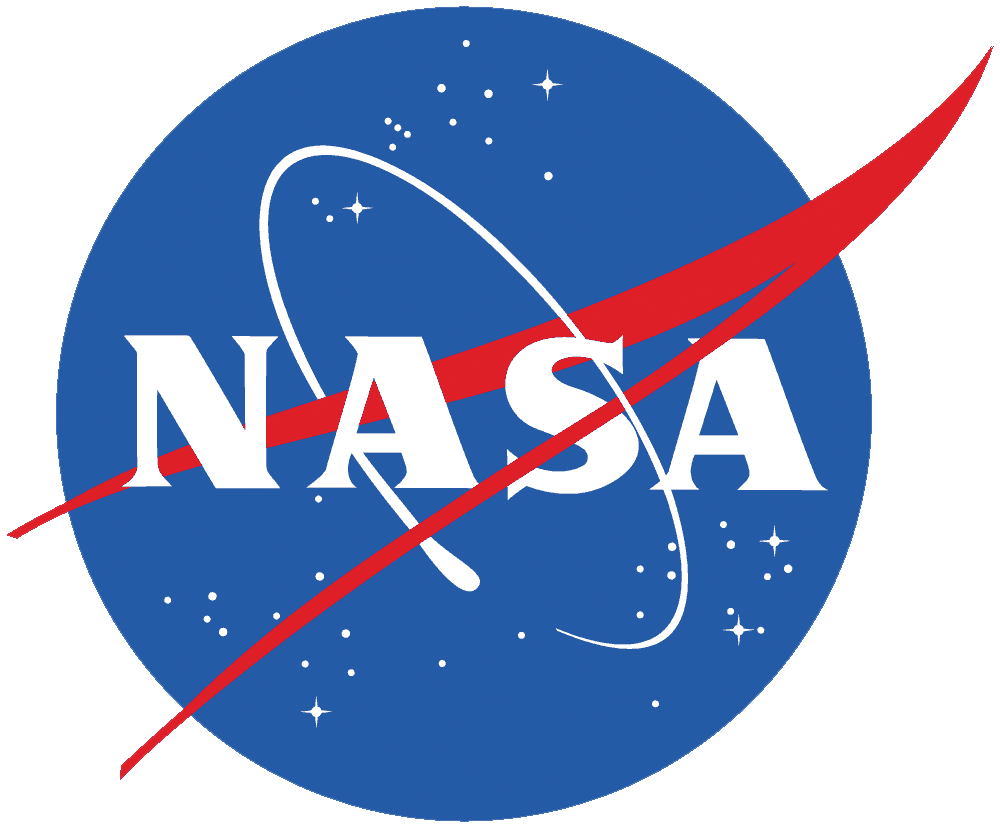

# ASSERT: A Software Suite for Earth-systems Regression Testing
### About
This repository showcases my work during the summer of 2023 on ASSERT during my internship with Science Systems and Applications, Inc as a Software Developer Engineer. The two main portions of the repository are my [presentation document](./ASSERT_Prez.pptx) and the [code](./assert/) I developed.

I was part of the [Advanced Software Technology Group](https://astg.pages.smce.nasa.gov/website/) (ASTG), a subdivision of the [NASA Center for Climate Solutions](https://www.nccs.nasa.gov) (NCCS) at NASA Goddard Space Flight Center.

   

For more information about ASSERT itself, visit the project's README file [here](./assert/doc/README.md).
