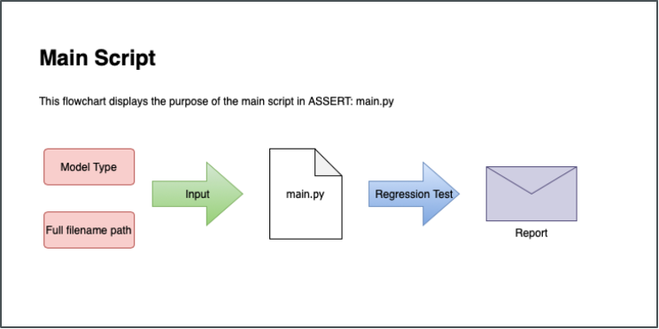

# ASSERT Documentation

<!-- COMMENT
For reference:
__Bold 1__ **Bold 2**
_Italic 1_ *Italic 2*
~~Strikethrough~~
<sub>Subscript
<sup>Superscript
> Quoted text
>
`In-line quoted code`

```
Block quoted code
```
[Link](https://google.com)

- Item 1
* Item 2
+ Item 3

1. Step 1
2. Step 2
3. Step 3

4) Step 4
5) Step 5
6) Step 6

- [x] Task 1
- [ ] Task 2
- [ ] Task 3


\*Ignore markdown formatting*

Line\
Break -->

### Developers
**Carlos Cruz**: carlos.a.cruz@nasa.gov\
**Jules Kouatchou**: jules.kouatchou-1@nasa.gov\
**Bruce Van Aartsen**: bruce.vanaartsen@nasa.gov\
**Deon Kouatchou**: ddkouatchou@hotmail.com

## Directory Structure


## Functionality

Using the code in the src module, the main script takes in
the model type and configuration file name through the command-line,
runs the regression test, and generates an email report.

```
python main.py <config_file.yaml> -m <model_type>
```



### Main Directories:

[__assert/src >>__](../src/README.md)

[__assert/test >>__](../test/README.md)