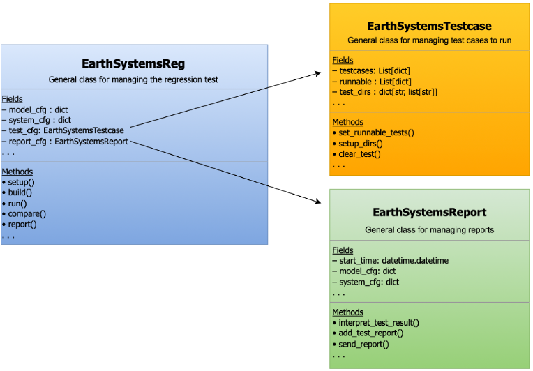

[__<< assert/src__](../README.md)

# ASSERT lib module

The `lib` module contains all library-related code that is
used extensively throughout ASSERT.

```
 .
 |______init__.py
 |____utils
 |  |______init__.py
 |  |____access_repo.py
 |  |____config.py
 |  |____datatypes.py
 |  |____forecasting_metrics.py
 |  |____logger.py
 |  |____paths.py
 |  |____server.py
 |  |____time.py
 |______init__.py
 |____earthsystems_reg.py
 |____earthsystems_report.py
 |____earthsystems_testcase.py
```

## Generic Classes
The generic classes provide an interface/framework for how
model-specific regression tests how managed and structured in
ASSERT.



### Sub-directories

[__assert/lib/utils >>__](./utils/README.md)
