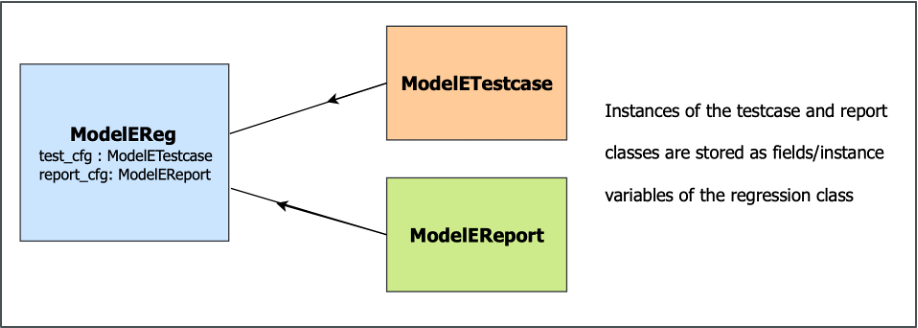

[__<< src__](../README.md)

# ASSERT models module

The `models` module contains the model-specific code infrastructure.

This includes model-specific implementation of generic class
interfaces as well as model-specific utility files.

```
 .
 |______init__.py
 |  |____gce
 |  |  |______init__.py
 |  |  |____gce_reg.py
 |  |  |____gce_report.py
 |  |  |____gce_testcase.py
 |  |____geos
 |  |  |______init__.py
 |  |  |____geos_reg.py
 |  |  |____geos_report.py
 |  |  |____geos_testcase.py
 |  |____model_e
 |  |  |______init__.py
 |  |  |____model_e_reg.py
 |  |  |____model_e_report.py
 |  |  |____model_e_testcase.py
 |  |  |____model_e_utils.py
 |  |____nuwrf
 |  |  |______init__.py
 |  |  |____nuwrf_reg.py
 |  |  |____nuwrf_report.py
 |  |  |____nuwrf_testcase.py
```

### Class/File Dynamics

The `Reg` class manages regression testing as a whole,
the `Testcase` class manages test information, and the `Report`
class manages report generation.



They have the same dynamic as their generic class counterparts
found in the `assert/lib` module.

___


## Model Integration

To integrate a new model into ASSERT, these three classes need to
be implemented, each in their own files. These files would be
located in a submodule of `assert/models`

For example, if a model is name `Atlas`, then it would be integrated
in the directories as followed under `assert/models`

```
 .
 |____atlas
 |  |______init__.py
 |  |____atlas_reg.py
 |  |____atlas_report.py
 |  |____atlas_testcase.py
```

- The `AtlasReg` class would be in the `atlas_reg.py` file
- The `AtlasReport` class would be in the `atlas_report.py` file
- The `AtlasTestcase` class would be in the `atlas_testcase.py` file

___

### I. `Reg` Class

Every new model type added to ASSERT needs a `Reg` class to manage
its regression testing.

Below is a "bare-bones" examplel of what it should look like in
`assert/src/models/atlas/atlas_reg.py`:

```
import datetime as dt

from src.lib.earthsystems_reg import EarthSystemsReg
from src.models.atlas.atlas_testcase import AtlasTestcase
from src.models.atlas.atlas_report import AtlasReport


class AtlasReg(EarthSystemsReg):
    def __init__(self, yaml_file: str, start_time: dt.datetime):
        """
        Parameters
        ----------
        yaml_file : str
            YAML config file name
        start_time : dt.datetime
            Starting time as a datetime object

        """
        super().__init__(yaml_file, start_time)
    . . .
```

\
__1. Class Initialization Helpers__: These functions are used in
the `__init__` function to set instance variables

- `get_repo_type()`: gets the type of remote repo from the YAML file

```
    def get_repo_type(self) -> str:
        """
        Atlas implementation of get_repo_type()

        Returns
        -------
        str
            Type of remote repository

        """
        pass
```

- `get_repo_url()`: gets the remote repo URL from the YAML file

```
    def get_repo_url(self) -> str:
        """
        Atlas implementation of get_repo_url()

        Returns
        -------
        str
            Repository URL

        """
        pass
```

- `get_repo_branch()`: gets the branch name of the remote
  repo from the YAML file

```
    def get_repo_branch(self) -> str:
        """
        Atlas implementation of get_repo_branch()

        Returns
        -------
        str
            Repository branch

        """
        pass
```

- `get_scratch_dir()`: gets the testing scratch directory
  from the YAML file

```
    def get_scratch_dir(self) -> str:
        """
        Atlas implementation of get_scratch_dir()

        Returns
        -------
        str
            Scratch directory

        """
        pass
```

- `set_test_cfg()`: sets the instance variable that handles
  an `AtlasTestcase` class object

```
    def set_test_cfg(self, yaml_dict: dict) -> EarthSystemsTestcase:
        """
        Sets the test cfg class according to Atlas.

        Parameters
        ----------
        yaml_dict : dict
            Config dictionary

        Returns
        -------
        AtlasTestcase
            Testcase manager class object for Atlas

        """
        return AtlasTestcase(
            test_cfg=...,
            scratch_dir=self.get_scratch_dir()
        )
```

- `set_report_cfg()`: sets the instance variable that handles
  an `AtlasReport` class object

```
    def set_report_cfg(self, yaml_dict: dict) -> EarthSystemsReport:
        """
        Sets the report cfg class according to Atlas.

        Parameters
        ----------
        yaml_dict : dict
            Config dictionary

        Returns
        -------
        AtlasReport
            Report manager class object for Atlas

        """
        return AtlasReport(
            model_cfg=self.model_cfg,
            system_cfg=self.system_cfg,
            report_cfg=...,
            start_time=self.start_time
        )
```

\
__2. Regression Testing Implementers__: These functions implement
regression testing for the model.

- `setup()`: Creates the directory structure in the scratch
  directory, clones/checks out code from the remote repository into
  those directories, etc.

```
    def setup(self) -> None:
        """
        Atlas implementation of setup()

        """
        pass
```

- `compile()`: Compiles/builds the code that was clone/checked out
  in the scratch directory for a particular test

```
    def compile(self, test_name: str, cwd: str) -> None:
        """
        Atlas implementation of compile()

        Parameters
        ----------
        test_name : str
            Name of test whose imported code will be compiled
        cwd : str
            Current working directory (should be appropriate)

        """
        pass
```

- `run()`: Runs the code for a test

```
    def run(self, test_name: str, cwd: str) -> None:
        """
        Atlas implementation of run()

        Parameters
        ----------
        test_name : str
            Name of test whose imported code will be compiled
        cwd : str
            Current working directory (should be appropriate)

        """
        pass
```

- `compare()`: Runs comparisons based on the run results of
  a test

```
    def compare(self, test_name: str, cwd: str) -> None:
        """
        Atlas implementation of compare()

        Parameters
        ----------
        test_name : str
            Name of test whose imported code will be compiled
        cwd : str
            Current working directory (should be appropriate)

        """
        pass
```

- `initialize()`: Runs `setup()`, `compile()`, `run()`, and
  `compare()` (i.e. runs the regression test)

```
    def initialize(self) -> None:
        """
        Atlas implementation of initialize()

        """
        pass
```

- `report`: Generates and sends report and is called after
  `initialize()` by `assert/main.py`

```
    def report(self, end_time: dt.datetime) -> None:
        """
        Atlas implementation of report()

        Parameters
        ----------
        end_time : dt.datetime
        
        """
        pass
```

___

### II. `Testcase` Class

Every new model type added to ASSERT needs a `Testcase` class to
oversee tests that the model supports.

```
import logging

from src.lib.earthsystems_testcase.py import EarthSystemsTestcase


class AtlasTestcase(EarthSystemsTestcase):
    def __init__(self, test_cfg: list(dict), scratch_dir: str):
        """
        Parameters
        ----------
        test_cfg : list(dict)
            Information from the test configurations
        scratch_dir: str
            Scratch directory for the model

        """
        super().__init__(test_cfg, scratch_dir)

    def setup_tests(self, time_stamp: str = None) -> None:
        """
        Atlas implementatino of setup_tests()

        Parameters
        ----------
        time_stamp : str
            Time stamp as a string (datetime)

        """
        pass
```

___

### III. `Report` Class

Every new model type added to ASSERT needs a `Report` class to
handle generating reports.

```
import datetime as dt
import logging

from typing import Any
from src.lib.earthsystems_report import EarthSystemsReport


class Atlas(EarthSystemsReport):
    def __init__(self, model_cfg: dict,
                 system_cfg: dict,
                 report_cfg: dict,
                 start_time: dt.datetime):
        """
        Parameters
        ----------
        model_cfg : dict
            Passed on model configuration info
        system_cfg : dict
            Passed on system configuration info
        report_cfg : dict
            Passed on report configuration info

        start_time : str
            Passed on reg start time from datetime module

        """
        super().__init__(model_cfg, system_cfg,
                         report_cfg, start_time)
```

__1. Class Initialization Helpers__: These functions are used in
the `__init__` function to set instance variables

- `set_subject()`: gets the email subject message from the YAML
  dictionaries

```
    def set_subject(self) -> str:
        """
        Atlas implementation of set_subject()

        Returns
        -------
        str
            Email subject message

        """
        pass
```

- `set_addresses()`: gets the email addresses of recipients from
  the YAML dictionaries

```
    def set_addresses(self) -> list[str]:
        """
        Atlas implementation of set_addresses()

        Returns
        -------
        list[str]
            List of email addresses
        """
        pass
```

- `set_html()`: gets the HTML flag from the YAML dictionaries

```
    def set_html(self) -> bool:
        """
        Atlas implementation of set_html()

        Returns
        -------
        bool
            True if using HTML format, False if not.
        """
        pass
```

- `set_header()`: sets the table header for the model report

```
    def set_header(self) -> list[str]:
        """
        Atlas implementation of set_header()

        Returns
        -------
        list[str]
            Atlas report table header

        """
        pass
```

- `set_legend()`: sets the legend for the model report

```
    def set_legend(self) -> dict[str, str]:
        """
        Atlas implementation of set_legend()

        Returns
        ----------
        dict[str, str]
            A model-specific legend

        """
        pass
```

__2. Report Implementers__: These functions implement report
generation for the model's regression testing

- `interpret_test()`: Translates a test result to a legend symbol

```
    def interpret_test(self, res: Any) -> str:
        """
        Atlas implementation of interpret_test()

        Parameters
        ----------
        res : Any
            Information about a test result

        Returns
        -------
        str
            Legend symbol for test result

        """
        pass
```

- `add_test_report()`: Adds test results to text report
  (`self.report` instance variable)

```
    def add_test_report(self) -> None:
        """
        Atlas implementation of add_test_report()

        """
        pass
```

- `add_legend_report()`: Adds legend to text report

```
    def add_legend_report(self) -> None:
        """
        Atlas implementation of add_legend_report()

        """
        pass
```

- `send_report()`: Completes text report and sends it up to
  the `Reg` class to then email it

```
    def send_report(self, end_time: dt.datetime) -> str:
        """
        Atlas implementation of send_report()

        Parameters
        ----------
        end_time : dt.datetime
            End time to add to report and get elapsed time

        Returns
        -------
        str
            Final report output

        """
        if self.use_html:
            self.report = "<html><pre>"
        self.report += f"""
{'=' * 60}
ASSERT: A Software Suite for Earth-systems Regression Testing
{'=' * 60}
MODEL TYPE: Atlas
"""
        ...
        self.add_test_report()
        ...
        self.add_legend_report()
        ...

        # Add start datetime, end datetime, and elapsed time
        elapsed_time = (end_time - self.start_time).total_seconds()

        self.report += f"""\n
{'=' * 60}
Start Time:         {self.start_time.strftime('%Y-%m-%d %H:%M:%S')}
End Time:           {end_time.strftime('%Y-%m-%d %H:%M:%S')}
Total Time Elapsed: {elapsed_time}
{'=' * 60}
        """
        if self.use_html:
            self.report += "</pre><html>\n"

        return self.report
```

