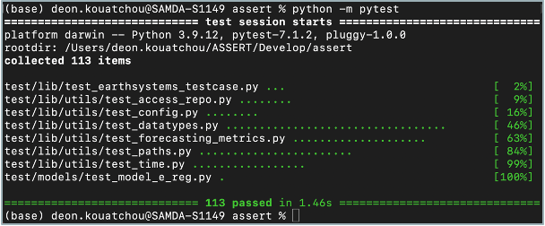

[__<< Home__](../doc/README.md)

# ASSERT test module

The `test` module contains all of ASSERT's unit testing.
These tests use Python's `pytest` module to test ASSERT's functionality.

This is different from the regression testing itself.

```
 .
 |______init__.py
 |____lib
 |  |_____init__.py
 |  |____utils
 |  |  |______init__.py
 |  |  |____test_access_repo.py
 |  |  |____test_config.py
 |  |  |____test_datatypes.py
 |  |  |____test_forecasting_metrics.py
 |  |  |____test_paths.py
 |  |  |____test_time.py
 |  |____test_earthsystems_testcase.py
 |____models
 |  |____model_e
 |  |  |______init__.py
 |  |  |____test_model_e_reg.py
```

\
